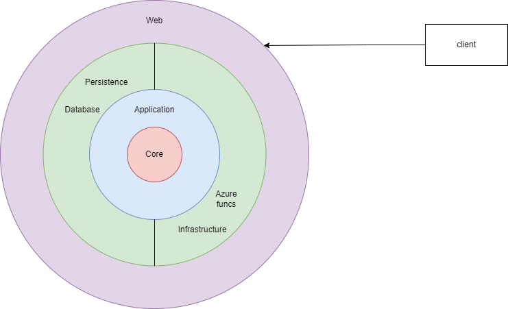

# ToDo App
## Description

This is a demo project with ToDo app functionality: managing tasks, projects, users.
Application was written using ASP.NET Core framework, MS SQL Server and Angular framework. 

This project is my demo and was built to obtain usefull skills in Clean Architecture, web development, database administration, CI/CD.

## Working link
If my azure subscription is active, you can try this project [here](https://client-14866.azurewebsites.net)

## Project structure

## Current functionality
Non authorized users have no access to project.
Authorized users mat be admins, managers or employees.

Admins:
* Manage user roles, delete users

Managers:
* Create projects
* Manage project tasks and employees

Employees:
* Manage task statuses

All users can receive notifications in real time about usefull information concerning their field of work.
Managers and employees can obtain tasks of their projects with additional description.

## Installation and running
In order to work with this project locally, Visual Studio and SQL Server are needed.
1. Clone this repository
2. Open solution in Visual Studio
3. Rebuild solution
4. Create database with name ReenbitProjectDb
5. Publish Database project to created db
6. Run Web project

For client project, look at [client readme](./client/README.md)
